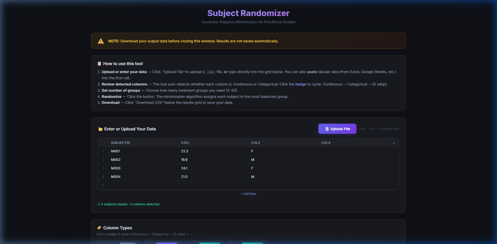
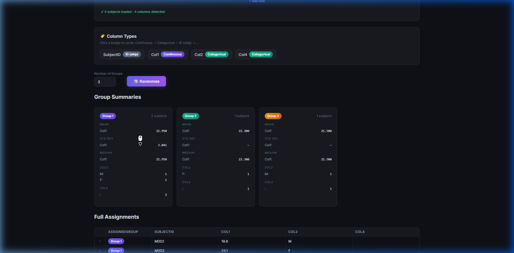

# 🎲 Subject Randomizer

**Covariate-Adaptive Minimization for Preclinical Studies**

A browser-based tool for randomizing research subjects into balanced treatment groups using the Pocock & Simon minimization algorithm. No installation required — runs entirely in your browser.

🔗 **[Launch the Tool](https://genesig.github.io/Subject_Randomizer/)**

---

## Purpose

When designing preclinical experiments, subjects must be distributed across treatment groups so that baseline covariates (body weight, tumor volume, sex, cage assignment, etc.) are balanced. Simple random assignment can produce uneven groups, especially with small sample sizes.

**Subject Randomizer** solves this by using *covariate-adaptive minimization* — each subject is assigned to the group that would minimize the overall imbalance across all covariates. The algorithm handles both **continuous** variables (e.g., weight, tumor volume) and **categorical** variables (e.g., sex, cage ID) simultaneously.

## How It Works

1. **Upload or enter your data** — Upload a `.csv` file, or paste tabular data directly from Excel or Google Sheets into the spreadsheet grid.
2. **Review detected columns** — The tool auto-detects whether each column contains continuous (numeric) or categorical (text/label) data. Click the badge to override the detected type.
3. **Set number of groups** — Choose how many treatment groups you need (2–20).
4. **Randomize** — Click the button. The minimization algorithm assigns each subject to the group that keeps covariates most balanced.
5. **Download** — Click "Download CSV" to save the results with group assignments.

## Features

- **Spreadsheet grid** — Editable grid with add/remove rows and columns; paste detection auto-parses tabular data
- **Auto-detection** — Columns are automatically classified as Continuous, Categorical, or *Skip* (meaning it won't be factored in the randomization)
- **Minimization engine** — Covariate-adaptive randomization balancing both continuous and categorical variables
- **Group summaries** — Each group card displays Mean, Standard Deviation, Median (continuous) and frequency counts (categorical)
- **CSV download** — Export the full assignment table with one click
- **Zero dependencies** — Runs entirely in-browser with no server, no login, and no external JavaScript libraries
- **Cross-browser** — Works identically on Chrome, Edge, Firefox, and Safari

## Algorithm

The randomization algorithm is an adaptation of the **Covariate-Adaptive Randomization** approach proposed by Pocock and Simon (1975). For each subject (presented in a random order via Fisher-Yates shuffle), the algorithm:

1. Tentatively places the subject into each candidate group
2. Calculates the total imbalance score across all covariates:
   - **Continuous variables**: range of group means (max − min)
   - **Categorical variables**: sum of range of counts per level
3. Assigns the subject to the group with the lowest resulting imbalance
4. If multiple groups are tied, one is chosen at random

This ensures that the final group assignments achieve near-optimal balance on all specified covariates, even with small sample sizes.

### Citation

> Pocock SJ, Simon R. Sequential treatment assignment with balancing for prognostic factors in the controlled clinical trial. *Biometrics*. 1975 Mar;31(1):103-15. PMID: [1100130](https://pubmed.ncbi.nlm.nih.gov/1100130/).

## Usage Notes

- **Data privacy**: All processing happens locally in your browser. No data is sent to any server.
- **Persistence**: Results are not saved between sessions. Download your CSV before closing the window.
- **File formats**: `.csv` and `.tsv` files are supported. For `.xlsx` files, save as `.csv` first.
- **Large datasets**: The tool is meant to handle 1000+ rows without performance issues.

## License

MIT
